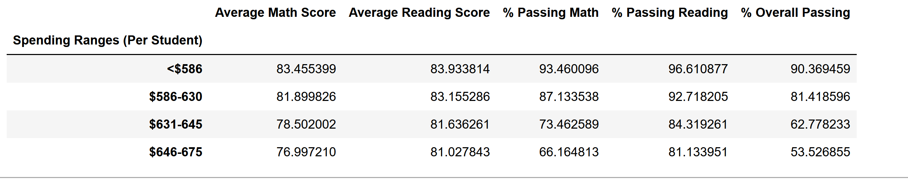
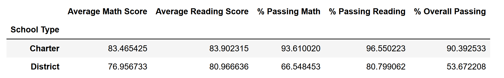

# School_District_Analysis

## Purpose
The purpose of thhis analysis was to remove the possibily fradulent data. Doing this allowed us to have an unbiased analysis on the school district's data.

## Results

- How is the district summary affected?

When comparting the districts before and after removing Thomas High School (THS) ninth graders the total schools, student and budgets stayed the same but the following changed.
  
    Average Math Score:Reduced from 79.0 to 78.9.
    Average Reading Score: No change.
    %Passing Math: Reduced from 75.0 to 74.8.
    %Passing Reading: Reduced from 85.8 to 85.7.
    % Overall Passing: Reduced from 65.2 to 64.9.
Before:

After

- How is the school summary affected?

When comparting the school before and after removing ninth graders the total schools, student and budgets stayed the same but the following changed.

    Average Math Score:Reduced from 83.41 to 83.35
    Average Reading Score: Increased 83.85 to 83.90
    %Passing Math: Reduced from 93.27 to 93.19
    %Passing Reading: Reduced from 97.31 to 97.02
    % Overall Passing: Reduced from 90.95 to 90.63.
Before:

After

- How does replacing the ninth graders’ math and reading scores affect Thomas High School’s performance relative to the other schools?

There was no change in the ranking. THS placed second before and after clean up.
Before:

After

- How does replacing the ninth-grade scores affect the following:

**Math and reading scores by grade**
  
Since 9th grade was the only thing removed there was no effect on the math and reading scores by grades for 10th to 12th grades. 

**Scores by school spending**

Since THS is in the $631-645 bin and this is the only bin that is effected.

      Average Math Score:Reduced from 78.52 to 78.50
      Average Reading Score: Increased from 81.62 to 81.64
      %Passing Math: Reduced from 73.48 to 73.46
      %Passing Reading: Reduced from 84.39 to 84.32
      % Overall Passing: Reduced from 62.86 to 62.78
 Before:

After

**Scores by school size**
  
Since THS is a medium school and this catagory was the only one effected.
    
      Average Math Score:Reduced from 83.37 to 83.36
      Average Reading Score: Increased from 83.86 to 83.87
      %Passing Math: Reduced from 93.60 to 93.58 
      %Passing Reading: Reduced from 96.79 to 96.73
      % Overall Passing: Reduced from 90.62 to 90.56
Before:

After
  
**Scores by school type**
  
Since THS is a charter school and this catagory was the only one effected.
      Average Math Score:Stayed the same at 83.47 
      Average Reading Score: Stayed the same at 83.90 
      %Passing Math: Reduced from 93.62 to 93.61
      %Passing Reading: Reduced from 96.59 to 96.55
      % Overall Passing: Reduced from 90.43 to 90.39
Before:

After

## Summary

Overall after the grades had been replaced for major differences are that: The average math score decreased, the average reading score increased, the % passing for math decreased, he % passing for reading decreased, and the overall % decreased as well. Overall removing the THS 9th grade did not have a large impact on the overall popualtion.
